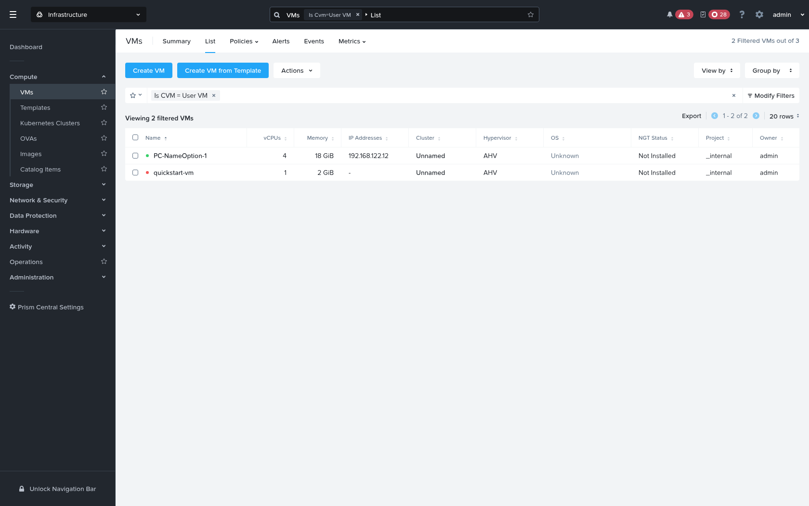
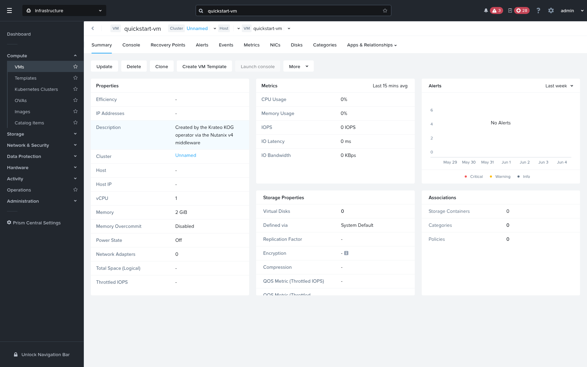
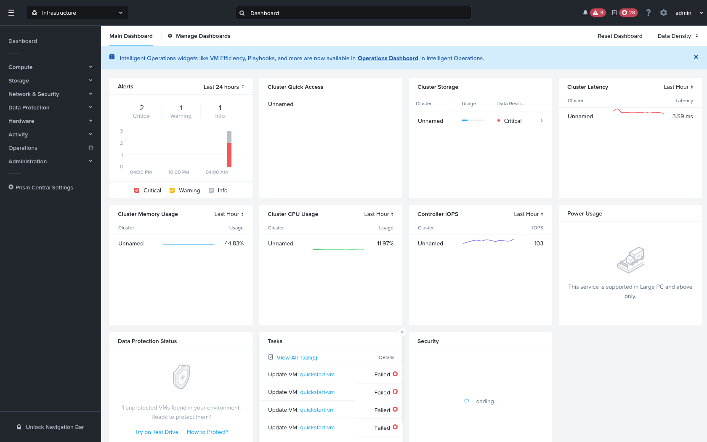

# Quickstart — Create a Nutanix VM with the Krateo KOG operator

This walks through creating an AHV virtual machine on **Nutanix Prism Central (GA v4.0)** declaratively with **Krateo** — apply a `RestDefinition`, then a `Vm` custom resource, and the KOG `rest-dynamic-controller` drives the Nutanix v4 API for you.

Because the Nutanix v4 API has several conventions a generic OpenAPI controller doesn't speak (a `$objectType` discriminator, an `NTNX-Request-Id` idempotency header, async task polling, ETag concurrency, and OData filters), this quickstart puts a small **translating middleware** between the controller and Prism Central. With it, the operator creates the VM end-to-end.

## Result

The operator-created VM in Prism Central — note the **Description: _"Created by the Krateo KOG operator via the Nutanix v4 middleware"_**:

**VM list** (`Compute → VMs`):



**VM details** (1 vCPU, 2 GiB, Power Off — exactly the `Vm` CR spec):



**Dashboard** (the VM also shows under Tasks / "1 unprotected VM"):



---

## Architecture

```
 ┌────────────┐   Vm CR    ┌──────────────────────────┐  HTTP (generic OpenAPI)
 │  kubectl   │──────────▶ │  KOG rest-dynamic-        │──────────────┐
 └────────────┘            │  controller (per RD)      │              ▼
                           └──────────────────────────┘   ┌────────────────────────┐
                                                           │  Nutanix v4 middleware │  Nutanix v4
                                                           │  (this repo)           │──────────────▶  Prism Central
                                                           └────────────────────────┘   /api/vmm/...
```

The middleware performs **7 translations** so the generic controller can speak Nutanix v4:

| # | Translation | Why |
|---|---|---|
| 1 | quote OData `$filter` values, and turn `?name=X` into `$filter=name eq 'X'` | Nutanix rejects unquoted filter values (`500`); the controller doesn't build OData |
| 2 | inject `$objectType` discriminator into create/update bodies | required by v4, derived from the path |
| 3 | inject `NTNX-Request-Id: <uuid>` on POST/PUT/DELETE | required idempotency header |
| 4 | resolve async `202 → task → SUCCEEDED → real resource` and return `200`; on a `FAILED`/`CANCELED`/timed-out task, surface a `502`/`504` with the task error | controller expects the resource in the create response, not a task — and must see failures instead of a masked `200` (else it retries a silently-failed update forever) |
| 5 | add `If-Match` ETag on PUT/DELETE (GET first to capture it) | v4 optimistic concurrency |
| 6 | unwrap the single-object `{data: {…}}` envelope on a successful response | so the controller reads the identifier / `additionalStatusFields` (e.g. `extId`) at the body root → `status.extId` |
| 7 | stringify integer values in observe (GET) responses | large ints (e.g. `memorySizeBytes` `2147483648`) otherwise decode as Go `float64` → `"2.147483648e+09"`, never match the int spec → endless `PUT`, `Ready` never latches. Strings round-trip cleanly |

It is **resource-agnostic**: the `$objectType` is *derived from the request path* (e.g. `/vmm/v4.0/ahv/config/vms` → `vmm.v4.ahv.config.Vm`, `/storage/v4.0.a3/config/volume-groups` → `storage.v4.r0.a3.config.VolumeGroup`), so one proxy serves every Nutanix v4 RestDefinition. Irregular cases can be pinned via the `OBJECTTYPE_OVERRIDES` env. Stdlib-only (no deps).

Code: [`middleware/nutanix_v4_proxy.py`](middleware/nutanix_v4_proxy.py) · image: [`middleware/Dockerfile`](middleware/Dockerfile) · manifest: [`middleware/deploy.yaml`](middleware/deploy.yaml). Config via env: `PC_BASE` (required), `TLS_VERIFY`, `TASK_TIMEOUT_S`, `OBJECTTYPE_OVERRIDES`, `LOG_LEVEL`; `/healthz` for probes.

The RD's **OpenAPI slice also needs three small adjustments** (the generator emits forms the controller can't consume) — see [Step 2](#2-prepare-the-vm-restdefinition--oas-slice).

---

## Prerequisites

- A Kubernetes cluster with **Krateo** + **oasgen-provider (KOG)** + **rest-dynamic-controller** installed.
- Network reachability from the cluster to Prism Central `:9440`.
- PC credentials (here `admin` / `••••`) and a **registered Prism Element** cluster `extId` (`GET /clustermgmt/v4.0/config/clusters`).

```bash
kubectl create ns nutanix-system 2>/dev/null || true
```

## 1. Deploy the proxy

No registry needed — run the stdlib script from a ConfigMap (Option B in `deploy.yaml`):

```bash
kubectl -n nutanix-system create configmap nutanix-proxy-src \
  --from-file=nutanix_v4_proxy.py=quickstart/middleware/nutanix_v4_proxy.py

# edit deploy.yaml: set PC_BASE to https://<PC-HOST>:9440/api
kubectl apply -f quickstart/middleware/deploy.yaml
kubectl -n nutanix-system rollout status deploy/nutanix-mw
```

(For production, build the image instead: `docker build -t <repo>/nutanix-v4-proxy:0.1 quickstart/middleware`, push, and set `image:` in `deploy.yaml`.)

## 2. Prepare the `Vm` RestDefinition + OAS slice

Start from `generated/vmm/oas/vm.yaml` and apply three fixes (a patched copy is provided at [`middleware/vm.oas-slice.patched.yaml`](middleware/vm.oas-slice.patched.yaml)):

1. **Point the server at the middleware** — `servers: [{ url: "http://nutanix-mw.nutanix-system.svc.cluster.local:8080" }]`.
2. **Expand range response codes** `4XX`/`5XX` → explicit `400`/`404`/`500`, and **add `200`** to `post`/`put`/`delete`. *(rest-dynamic-controller can't match range codes — this is the cause of the `invalid response code: 4XX` error.)*
3. **Drop the required `NTNX-Request-Id` / `If-Match` header params** (the middleware injects them) and **add a `name` query param** to the findby `GET` (so the controller filters by name; the middleware turns it into an OData `$filter`).

```bash
kubectl -n nutanix-system create configmap nutanix-vmm-vm-oas \
  --from-file=vm.yaml=quickstart/middleware/vm.oas-slice.patched.yaml
kubectl apply -f generated/vmm/restdefinitions/vm.restdefinition.yaml
kubectl -n nutanix-system wait restdefinition/nutanix-vmm-vm --for=condition=Ready --timeout=180s
# generates the Vm + VmConfiguration CRDs and a controller:
kubectl get crd vms.vmm.nutanix.krateo.io vmconfigurations.vmm.nutanix.krateo.io
```

> **⚠️ The `Vm` CR must not set `extId`, and the generated CRD must not *require* it.** `extId` is discovered by the controller — the RD's `excludedSpecFields` must include it (as in the repo RD) so it's kept out of the CRD `spec`. If you applied an **older RD** whose `excludedSpecFields` lacked `extId`, the CRD will *require* it, forcing you to set a bogus value; the controller then does a `GET /vms/<bogus-extId>` → Prism `400` (`observe failed: unexpected status: 400`). `excludedSpecFields` is **immutable**, so fix it by recreating the RD — or patch the live CRD:
>
> ```bash
> kubectl patch crd vms.vmm.nutanix.krateo.io --type=json \
>   -p '[{"op":"replace","path":"/spec/versions/0/schema/openAPIV3Schema/properties/spec/required","value":["configurationRef"]}]'
> ```
>
> Then create the `Vm` **without** `extId` (Step 4).

## 3. Credentials + endpoint

```yaml
apiVersion: v1
kind: Secret
metadata:
  name: nutanix-pc-auth
  namespace: nutanix-system
type: Opaque
stringData:
  username: admin
  password: "<your-pc-password>"
---
apiVersion: vmm.nutanix.krateo.io/v1alpha1
kind: VmConfiguration
metadata:
  name: nutanix-pc
  namespace: nutanix-system
spec:
  authentication:
    basic:
      usernameRef:
        name: nutanix-pc-auth
        namespace: nutanix-system
        key: username
      passwordRef:
        name: nutanix-pc-auth
        namespace: nutanix-system
        key: password
```

## 4. Create the VM

```yaml
apiVersion: vmm.nutanix.krateo.io/v1alpha1
kind: Vm
metadata:
  name: quickstart-vm
  namespace: nutanix-system
spec:
  configurationRef:
    name: nutanix-pc
    namespace: nutanix-system
  name: quickstart-vm
  description: "Created by the Krateo KOG operator via the Nutanix v4 middleware"
  numSockets: 1
  numCoresPerSocket: 1
  memorySizeBytes: 2147483648          # 2 GiB
  cluster:
    extId: "<REGISTERED-PE-CLUSTER-EXTID>"
  # NOTE: do NOT set powerState on create (the API rejects it; the VM defaults to OFF)
```

```bash
kubectl apply -f vm.yaml
kubectl -n nutanix-system get vms.vmm.nutanix.krateo.io quickstart-vm
# → Synced=True; the controller POSTs through the middleware, which resolves the
#   async task and returns the created VM. It now appears in Prism Central (above).
```

The controller's create flows: `findby (?name=…) → not found → POST → 202 → middleware polls task → returns the VM`. Verify on the PC with `GET /vmm/v4.0/ahv/config/vms?$filter=name eq 'quickstart-vm'`.

## 5. Clean up

```bash
kubectl -n nutanix-system delete vms.vmm.nutanix.krateo.io quickstart-vm
```

---

## Notes & current limitations

- **What works end-to-end:** RD → generated CRDs + controller, `VmConfiguration` auth, **create** *and* steady-state reconcile — the `Vm` reaches **`Synced=True` and `Ready=True/Available`**, and the VM is created on Prism Central via the middleware (see screenshots).
- **Status & readiness:** `status.extId` is lifted from the `{data}` envelope by translation #6 (get-by-id path). Reaching **`Ready=True`** additionally needs the observed resource to compare *equal* to the spec — and `rest-dynamic-controller` 0.8.0 decodes JSON numbers as Go `float64`, so a large int such as `memorySizeBytes` returned as `2.147483648e+09` and never matched the int spec → the controller re-`PUT`s on every reconcile and `Ready` stays `Creating`. **Translation #7** (stringify ints in observe responses) fixes the round-trip, so `isUpToDate` holds and the controller sets `Available`. No controller change required (0.8.0 is the current release).
- **Generic, not VM-specific:** the middleware keys `$objectType` by path, so the same proxy works for other Nutanix v4 RestDefinitions (categories, subnets, … and a future NDB/database RD) — the controller/middleware layer is foundational, solved once.
- These findings (range-code handling, required-header params, `{data}` envelope, OData filter quoting) are the same RD-level items documented in `GA_V4_FULL_CRUD.md` §6.
