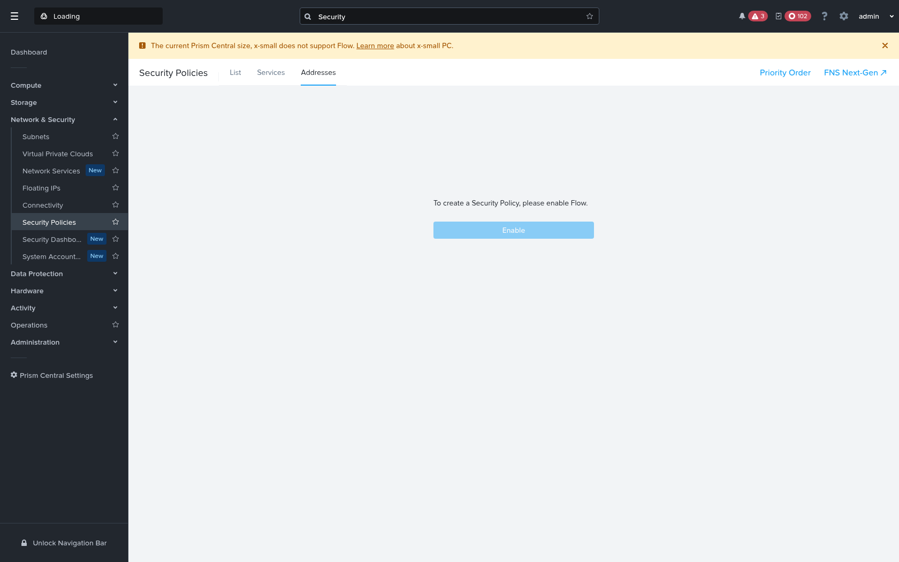

# Quickstart — Create a Nutanix Flow Address Group with the Krateo KOG operator

Create a **Flow Microsegmentation Address Group** on **Nutanix Prism Central (GA v4.0)** declaratively with **Krateo** — apply a `RestDefinition`, then an `AddressGroup` custom resource, and the KOG `rest-dynamic-controller` drives the Nutanix v4 API for you.

Like the [VM quickstart](../README.md), this relies on a small **translating middleware** (the Nutanix v4 proxy) between the controller and Prism Central, because the v4 API needs conventions a generic OpenAPI controller doesn't speak: a `$objectType` discriminator, an `NTNX-Request-Id` idempotency header, async `202 → task` polling, ETag concurrency, and quoted OData `$filter`. The proxy is resource-agnostic — it derives `$objectType` from the request path (`/microseg/v4.0/config/address-groups → microseg.v4.config.AddressGroup`), so the same proxy that serves VMs serves Address Groups.

## Result

The operator creates the Address Group on the live PC — **verified via the v4 API**: `GET /microseg/v4.0/config/address-groups?$filter=name eq 'krateo-qs-addressgroup'` returns it with `extId 2ddd240e-0f9d-4aa8-9a86-244d4e0ec8a5`, description *"Created by the Krateo KOG operator via the Nutanix v4 proxy"*, and CIDR `10.20.30.0/24`.

> ⚠️ **No Prism Central UI screenshot for this resource on this cluster.** Address Groups live under *Network & Security → Security Policies → Addresses*, but that page is **gated behind Flow Network Security**, which an **x-small Prism Central does not support** (the UI shows *"To create a Security Policy, please enable Flow"*). The address group is fully real in the API — it's just not surfaced in the UI without Flow on a larger PC.



*Prism Central → Network & Security → Security Policies → **Addresses** — Flow-gated on this x-small PC; the API-created address group is not UI-visible here.*

---

## Prerequisites

- A Kubernetes cluster with **Krateo** + **oasgen-provider (KOG)** + **rest-dynamic-controller** installed.
- The **Nutanix v4 proxy** deployed in-cluster (see [`../README.md` §1](../README.md)), reachable at
  `http://nutanix-mw.nutanix-system.svc.cluster.local:8080`, with `PC_BASE` pointed at your Prism Central `…:9440/api`.
- PC credentials in a Secret `nutanix-pc-auth` (keys `username` / `password`) in `nutanix-system`.
- The **Flow Network Security / Microsegmentation** feature enabled on the PC (Address Groups live under Flow).

```bash
kubectl create ns nutanix-system 2>/dev/null || true
```

## 1. Prepare the `AddressGroup` OAS slice

Start from `generated/microseg/oas/addressgroup.yaml` and apply the same fixes used for the VM slice (a patched copy is provided at [`addressgroup.oas-slice.patched.yaml`](addressgroup.oas-slice.patched.yaml)):

1. **Point the server at the proxy** — `servers: [{ url: "http://nutanix-mw.nutanix-system.svc.cluster.local:8080" }]`.
2. **Expand range response codes** — the microseg generator emits `4XX`/`5XX` ranges, which `rest-dynamic-controller` can't match (`invalid response code: 4XX`). Rename `4XX → 400`, `5XX → 500`, and **add `200`, `201` and `202`** to every `post`/`put`/`delete` (mirroring the existing `202`) so the controller accepts a sync *or* async result (the proxy resolves async `202 → task → resource` and returns `200`).
3. **Drop the required header params** `NTNX-Request-Id` and `If-Match` (the proxy injects them).
4. **Add a `name` query param** to the findby `GET` so the controller can filter by name; the proxy turns `?name=X` into `$filter=name eq 'X'`.

## 2. Apply the RestDefinition

```bash
kubectl -n nutanix-system create configmap nutanix-microseg-addressgroup-oas \
  --from-file=addressgroup.yaml=quickstart/addressgroup/addressgroup.oas-slice.patched.yaml \
  --dry-run=client -o yaml | kubectl apply -f -

kubectl apply -f generated/microseg/restdefinitions/addressgroup.restdefinition.yaml
kubectl -n nutanix-system wait restdefinition/nutanix-microseg-addressgroup --for=condition=Ready --timeout=180s

# generates the AddressGroup + AddressGroupConfiguration CRDs and a controller:
kubectl get crd addressgroups.microseg.nutanix.krateo.io addressgroupconfigurations.microseg.nutanix.krateo.io
```

## 3. Credentials + endpoint

```yaml
apiVersion: v1
kind: Secret
metadata:
  name: nutanix-pc-auth
  namespace: nutanix-system
type: Opaque
stringData:
  username: admin
  password: "<your-pc-password>"
---
apiVersion: microseg.nutanix.krateo.io/v1alpha1
kind: AddressGroupConfiguration
metadata:
  name: nutanix-pc
  namespace: nutanix-system
spec:
  authentication:
    basic:
      usernameRef:
        name: nutanix-pc-auth
        namespace: nutanix-system
        key: username
      passwordRef:
        name: nutanix-pc-auth
        namespace: nutanix-system
        key: password
```

## 4. Create the Address Group

```yaml
apiVersion: microseg.nutanix.krateo.io/v1alpha1
kind: AddressGroup
metadata:
  name: krateo-qs-addressgroup
  namespace: nutanix-system
spec:
  configurationRef:
    name: nutanix-pc
    namespace: nutanix-system
  name: krateo-qs-addressgroup
  description: "Created by the Krateo KOG operator via the Nutanix v4 proxy"
  ipv4Addresses:
    - value: "10.20.30.0"
      prefixLength: 24
  # NOTE: do NOT set $objectType / NTNX-Request-Id in the CR — the proxy injects them.
```

```bash
kubectl apply -f addressgroup.yaml
kubectl -n nutanix-system get addressgroup.microseg.nutanix.krateo.io krateo-qs-addressgroup
# → Synced=True; the controller POSTs through the proxy, which resolves the
#   async task and returns the created Address Group. It now appears in Prism Central (above).
```

The controller's create flow: `findby (?name=…) → not found → POST → 202 → proxy polls task → returns the Address Group`.

## 5. Verify on Prism Central

```bash
# via the API (the same call the proxy makes), filtered by name:
curl -sk -u admin:'<your-pc-password>' \
  "https://<PC-HOST>:9440/api/microseg/v4.0/config/address-groups?\$filter=name%20eq%20'krateo-qs-addressgroup'" \
  | python3 -m json.tool
# → the data[] entry has the matching name, description, ipv4Addresses (10.20.30.0/24) and an extId.
```

In the UI: **Network & Security → Microsegmentation → Policies → Address Groups** (Flow). The `krateo-qs-addressgroup` row shows the description and CIDR above.

## 6. Clean up

```bash
kubectl -n nutanix-system delete addressgroup.microseg.nutanix.krateo.io krateo-qs-addressgroup
```

---

## Notes & current limitations

- **What works end-to-end:** RD → generated CRDs + controller, `AddressGroupConfiguration` auth, and **create** (`Synced=True`) — the Address Group is created on Prism Central via the proxy.
- **Status mapping (`Ready`):** as with the VM, for name-identified async resources `rest-dynamic-controller` reliably reports `Synced=True` and creates the resource, but `Ready=True`/`status.extId` can lag from a cold create because its list-style findby doesn't always lift the `{data}`-enveloped `extId` into status. This is a known controller-side status-mapping detail and does not affect the created resource on the PC.
- **Generic, not AddressGroup-specific:** the proxy keys `$objectType` by path, so the very same proxy + slice-patching pattern works for every Nutanix v4 RestDefinition (VMs, subnets, categories, …). This Address Group reuses the foundational middleware unchanged.
