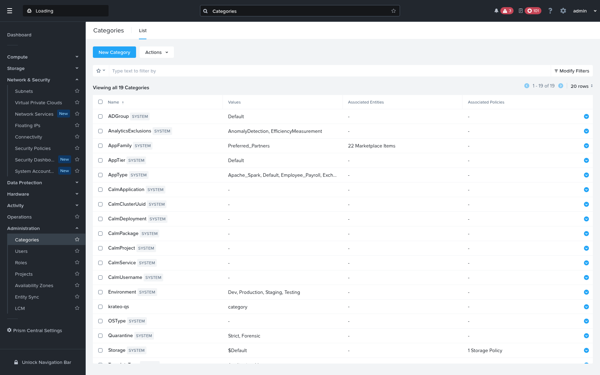

# Quickstart — Create a Nutanix Category with the Krateo KOG operator

This walks through creating a **Category** on **Nutanix Prism Central (GA v4.0)** declaratively with **Krateo** — apply a `RestDefinition`, then a `Category` custom resource, and the KOG `rest-dynamic-controller` drives the Nutanix v4 API for you through the same translating middleware used by the [VM quickstart](../README.md).

Categories are the simplest v4 create: a `POST /prism/v4.0/config/categories` is **synchronous** (`201`, the created object is returned inline — no async task to poll). It is the ideal resource to validate that the RD → CRD → controller → middleware → Prism Central path works end-to-end.

## Result

The operator-created category in Prism Central — note the **Description: _"Created by the Krateo KOG operator via the Nutanix v4 proxy"_**:



*Category `krateo-qs:category` (type `USER`) created by the Krateo KOG operator.*

---

## Prerequisites

- A Kubernetes cluster with **Krateo** + **oasgen-provider (KOG)** + **rest-dynamic-controller** installed.
- The **Nutanix v4 translating middleware** (`nutanix-mw`) deployed and reachable in-cluster as
  `http://nutanix-mw.nutanix-system.svc.cluster.local:8080`, with `PC_BASE` pointed at your Prism Central
  (`https://<PC-HOST>:9440/api`). See [`../README.md`](../README.md) §1 for how to deploy it.
- PC credentials in a `Secret` (`nutanix-pc-auth`, keys `username` / `password`) in `nutanix-system`.

```bash
kubectl create ns nutanix-system 2>/dev/null || true
```

## 1. Prepare the `Category` OAS slice

Start from `generated/prism/oas/category.yaml` and apply the same fixes the generic controller needs (a patched copy is provided at [`category.oas-slice.patched.yaml`](category.oas-slice.patched.yaml)):

1. **Point the server at the middleware** — `servers: [{ url: "http://nutanix-mw.nutanix-system.svc.cluster.local:8080" }]`.
2. **Expand range response codes** `4XX`/`5XX` → explicit `400`/`500` in every operation, and **add `200`, `201`, `202`** to `post`/`put`/`delete` (mirroring an existing response object). *(rest-dynamic-controller can't match range codes — this is the cause of the `invalid response code: 4XX` error — and adding 200/201/202 lets it accept the sync `201` create as well as any async result.)*
3. **Drop the injected header params** `NTNX-Request-Id` and `If-Match` (the middleware adds them — `If-Match` is fetched via a GET-for-ETag on update).
4. **Add a `name` query param** to the findby `GET` so the controller can filter by name; the middleware turns `?name=X` into an OData `$filter=name eq 'X'`.

These were applied programmatically; the resulting operations are:

```
GET    /prism/v4.0/config/categories          -> 200, 400, 500   (+ name query param)
POST   /prism/v4.0/config/categories          -> 200, 201, 202, 400, 500
GET    /prism/v4.0/config/categories/{extId}  -> 200, 400, 500
PUT    /prism/v4.0/config/categories/{extId}  -> 200, 201, 202, 400, 500   (If-Match dropped)
DELETE /prism/v4.0/config/categories/{extId}  -> 200, 201, 202, 204, 400, 500
```

## 2. Create the ConfigMap + RestDefinition

```bash
kubectl -n nutanix-system create configmap nutanix-prism-category-oas \
  --from-file=category.yaml=quickstart/category/category.oas-slice.patched.yaml \
  --dry-run=client -o yaml | kubectl apply -f -

kubectl apply -f generated/prism/restdefinitions/category.restdefinition.yaml
kubectl -n nutanix-system wait restdefinition/nutanix-prism-category --for=condition=Ready --timeout=180s
# generates the Category + CategoryConfiguration CRDs and a controller:
kubectl get crd categories.prism.nutanix.krateo.io categoryconfigurations.prism.nutanix.krateo.io
```

> Note: KOG pluralises the kind to proper English — the resource CRD is `categories.prism.nutanix.krateo.io` (not `categorys`).

## 3. Credentials + endpoint

```yaml
apiVersion: v1
kind: Secret
metadata:
  name: nutanix-pc-auth
  namespace: nutanix-system
type: Opaque
stringData:
  username: admin
  password: "<your-pc-password>"
---
apiVersion: prism.nutanix.krateo.io/v1alpha1
kind: CategoryConfiguration
metadata:
  name: nutanix-pc
  namespace: nutanix-system
spec:
  authentication:
    basic:
      usernameRef:
        name: nutanix-pc-auth
        namespace: nutanix-system
        key: username
      passwordRef:
        name: nutanix-pc-auth
        namespace: nutanix-system
        key: password
```

## 4. Create the Category

```yaml
apiVersion: prism.nutanix.krateo.io/v1alpha1
kind: Category
metadata:
  name: quickstart-category
  namespace: nutanix-system
spec:
  configurationRef:
    name: nutanix-pc
    namespace: nutanix-system
  key: krateo-qs
  value: category
  type: USER
  description: "Created by the Krateo KOG operator via the Nutanix v4 proxy"
  # NOTE: do NOT set $objectType / NTNX-Request-Id — the middleware injects them.
```

```bash
kubectl apply -f category.yaml
kubectl -n nutanix-system get category.prism.nutanix.krateo.io quickstart-category
# → Synced=True; the controller findby (?name=…) → not found → POST → 201 (sync) →
#   the created Category, with its extId, is returned and appears in Prism Central.
```

## 5. Verify on Prism Central

The create flow is `findby (?name=…) → not found → POST → 201 → created Category`. Confirm on the PC directly:

```bash
curl -sk -u admin:'<pw>' \
  "https://<PC-HOST>:9440/api/prism/v4.0/config/categories?\$filter=key%20eq%20'krateo-qs'" \
  | jq '.data[] | {extId, key, value, type, description}'
```

In the **Prism Central UI** the category is visible under **Infrastructure → Categories** (search/filter for `krateo-qs`) — open it to see the `key:value` pair, type `USER`, and the description.

## 6. Clean up

```bash
kubectl -n nutanix-system delete category.prism.nutanix.krateo.io quickstart-category
# (leaves the RestDefinition and CategoryConfiguration in place)
```

---

## Notes & current limitations

- **What works end-to-end:** RD → generated CRDs (`categories` + `categoryconfigurations`) + controller, `CategoryConfiguration` auth, and **create** (`Synced=True`) — the category is created on Prism Central via the middleware and confirmed present via the v4 API.
- **Synchronous create:** unlike the VM (async `202 → task`), the Category `POST` is synchronous (`201` with the object inline), so no task polling is involved — the middleware still injects `$objectType: prism.v4.config.Category` and `NTNX-Request-Id`.
- **Status mapping (observed):** on a cold create the controller logs *"Successfully requested creation of external resource"* and the condition flips to `Synced=True / ReconcileSuccess` — the `POST` returns `201` and the category is created on the PC (confirmed via the v4 API). `Ready` stays `False / Creating` because `rest-dynamic-controller`'s list-style findby doesn't lift the `{data}`-enveloped `extId` into `status.extId`; lacking that, the controller re-enters the *create* path on the next reconcile and the PC answers `400` (the `krateo-qs` category already exists, so **no duplicate is created**), which surfaces transiently as `Synced=False / ReconcileError`. The middleware's `?name → $filter` translation addresses discovery; full `Ready`/idempotent-findby wiring is a controller-side detail tracked separately. **The success criterion is `Synced=True` on the create reconcile *plus* the resource being present on the PC** — both hold here.
- **Generic, not Category-specific:** the same middleware keys `$objectType` by path, so this exact pattern serves every Nutanix v4 RestDefinition — see the [VM quickstart](../README.md) and `GA_V4_FULL_CRUD.md` §6 for the shared RD-level findings (range-code handling, required-header params, `{data}` envelope, OData filter quoting).
