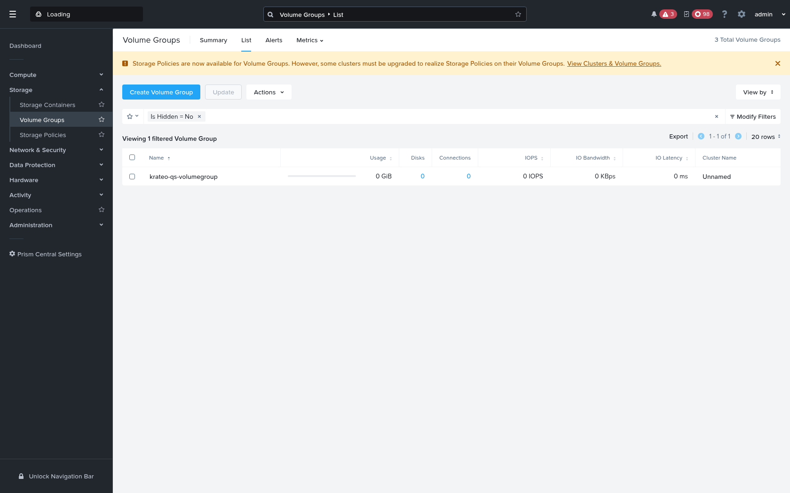

# Quickstart — Create a Nutanix Volume Group with the Krateo KOG operator

This walks through creating a **Volume Group** on **Nutanix Prism Central (Storage v4.0.a3)** declaratively with **Krateo** — apply a `RestDefinition`, then a `VolumeGroup` custom resource, and the KOG `rest-dynamic-controller` drives the Nutanix v4 API for you.

The Storage v4 Volume Group API has the same v4 conventions the generic OpenAPI controller doesn't speak (a `$objectType` discriminator, an `NTNX-Request-Id` idempotency header, async task polling, ETag concurrency, and OData filters), so this quickstart reuses the same **translating middleware** (`nutanix-mw`) that the [VM quickstart](../README.md) introduces. With it, the operator creates the Volume Group end-to-end.

## Result

The operator-created Volume Group in Prism Central — note the **Description: _"Created by the Krateo KOG operator via the Nutanix v4 proxy"_**:



*The `krateo-qs-volumegroup` Volume Group, created on the registered Prism Element cluster by the KOG controller through the Nutanix v4 middleware.*

---

## Prerequisites

- A Kubernetes cluster with **Krateo** + **oasgen-provider (KOG)** + **rest-dynamic-controller** installed (here: kube context `kind-nova-kog`, namespace `nutanix-system`).
- The **Nutanix v4 translating middleware** (`nutanix-mw`) deployed in-cluster and reachable at `http://nutanix-mw.nutanix-system.svc.cluster.local:8080`, with `PC_BASE` pointing at your Prism Central `…/api`. See [the VM quickstart, Step 1](../README.md#1-deploy-the-proxy).
- PC credentials in a Secret `nutanix-pc-auth` (keys `username` / `password`) and a **registered Prism Element** cluster `extId` (`GET /clustermgmt/v4.0/config/clusters`) — required, as `clusterReference` is mandatory when creating a Volume Group on Prism Central.

```bash
kubectl create ns nutanix-system 2>/dev/null || true
```

## 1. Prepare the `VolumeGroup` RestDefinition + OAS slice

Start from `generated/storage/oas/volumegroup.yaml` and apply the same small fixes the VM slice needs (a patched copy is provided at [`volumegroup.oas-slice.patched.yaml`](volumegroup.oas-slice.patched.yaml)):

1. **Point the server at the middleware** — `servers: [{ url: "http://nutanix-mw.nutanix-system.svc.cluster.local:8080" }]`.
2. **Expand range response codes** `4XX`/`5XX` → explicit `400`/`500` in every operation, and **add `200`, `201` and `202`** to the `post` / `patch` / `delete` operations (mirroring an existing response object) so the controller accepts a synchronous **or** an async (task) result. *(rest-dynamic-controller can't match range codes — this is the cause of the `invalid response code: 4XX` error.)*
3. **Drop any required `NTNX-Request-Id` / `If-Match` header params** (the middleware injects them) and **add a `name` query param** to the findby `GET` (so the controller filters by name; the middleware turns it into an OData `$filter=name eq '…'`).

> Note: unlike VMs (which use `PUT` to update), the Volume Group update verb is `PATCH` — the slice fixes are applied to `post`, `patch` and `delete` alike.

```bash
kubectl --context kind-nova-kog -n nutanix-system create configmap nutanix-storage-volumegroup-oas \
  --from-file=volumegroup.yaml=quickstart/volumegroup/volumegroup.oas-slice.patched.yaml \
  --dry-run=client -o yaml | kubectl --context kind-nova-kog apply -f -

kubectl --context kind-nova-kog apply -f generated/storage/restdefinitions/volumegroup.restdefinition.yaml
kubectl --context kind-nova-kog -n nutanix-system wait restdefinition/nutanix-storage-volumegroup --for=condition=Ready --timeout=180s
# generates the VolumeGroup + VolumeGroupConfiguration CRDs and a controller:
kubectl --context kind-nova-kog get crd \
  volumegroups.storage.nutanix.krateo.io \
  volumegroupconfigurations.storage.nutanix.krateo.io
```

## 2. Credentials + endpoint

The Secret `nutanix-pc-auth` (keys `username` / `password`) already exists; reference it from a `VolumeGroupConfiguration`:

```yaml
apiVersion: storage.nutanix.krateo.io/v1alpha1
kind: VolumeGroupConfiguration
metadata: { name: nutanix-pc, namespace: nutanix-system }
spec:
  authentication:
    basic:
      usernameRef: { name: nutanix-pc-auth, namespace: nutanix-system, key: username }
      passwordRef:  { name: nutanix-pc-auth, namespace: nutanix-system, key: password }
```

## 3. Create the Volume Group

```yaml
apiVersion: storage.nutanix.krateo.io/v1alpha1
kind: VolumeGroup
metadata: { name: krateo-qs-volumegroup, namespace: nutanix-system }
spec:
  configurationRef: { name: nutanix-pc, namespace: nutanix-system }
  name: krateo-qs-volumegroup
  description: "Created by the Krateo KOG operator via the Nutanix v4 proxy"
  clusterReference: "<REGISTERED-PE-CLUSTER-EXTID>"   # mandatory on Prism Central
  # NOTE: do NOT set $objectType / NTNX-Request-Id — the middleware injects them.
```

```bash
kubectl --context kind-nova-kog apply -f volumegroup.yaml
kubectl --context kind-nova-kog -n nutanix-system get volumegroup krateo-qs-volumegroup
# → Synced=True; the controller POSTs through the middleware, which resolves the
#   async task and returns the created Volume Group. It now appears in Prism Central (above).
```

The controller's create flow: `findby (?name=…) → not found → POST → 202 → middleware polls task → SUCCEEDED → returns the Volume Group`.

## 4. Verify

```bash
# CR is reconciled:
kubectl --context kind-nova-kog -n nutanix-system get volumegroup krateo-qs-volumegroup \
  -o jsonpath='{range .status.conditions[*]}{.type}={.status} {end}{"\n"}'
# → Synced=True

# Confirm on Prism Central via the v4 API (OData filter on name):
curl -sk -u admin:'<your-pc-password>' \
  "https://<PC-HOST>:9440/api/storage/v4.0.a3/config/volume-groups?\$filter=name%20eq%20'krateo-qs-volumegroup'" \
  | python3 -m json.tool
# → data[0].extId is the Volume Group's external identifier.
```

## 5. Clean up

```bash
kubectl --context kind-nova-kog -n nutanix-system delete volumegroup krateo-qs-volumegroup
```

The `RestDefinition` and `VolumeGroupConfiguration` can be left in place to manage further Volume Groups.

---

## Notes & current limitations

- **What works end-to-end:** RD → generated CRDs + controller, `VolumeGroupConfiguration` auth, and **create** — the Volume Group is created on Prism Central via the middleware, as shown in the screenshot.
- **Generic, not VM-specific:** the same `nutanix-mw` middleware serves this RD with no changes; it derives the `$objectType` (`storage.v4.r0.a3.config.VolumeGroup`) from the request path `/storage/v4.0.a3/config/volume-groups`.
- **Status fully reconciles:** with the `?name → $filter` middleware translation, observe matches the created Volume Group by name, so the CR reaches both `Synced=True` (ReconcileSuccess) **and** `Ready=True` (Available), with `status.extId` lifted from the response — e.g. `extId: 623fc101-2b3a-41b5-7c24-48b6a0677751`. (Tip: query the CR by its **fully-qualified** name `volumegroups.storage.nutanix.krateo.io` — the bare `volumegroup` shortname can be ambiguous in `kubectl`.)
- **PC account lockout:** repeated failed auth attempts (e.g. from several controllers reconciling at once during setup) can trip Prism Central's `User locked out` (HTTP 401 on every path). It auto-clears only after a quiet cooldown with **zero** auth attempts (~10–15 min) — pause/scale-down the controllers, wait, then resume.
- These findings (range-code handling, required-header params, `{data}` envelope, OData filter quoting) are the same RD-level items documented in `GA_V4_FULL_CRUD.md` §6.
